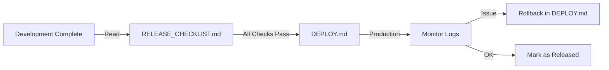

# Operations Documentation

Deze map bevat **deployment-, release- en operationele procedures** voor de live game.

---

## 📋 Beschikbare Documentatie

### Deployment
- [DEPLOY.md](DEPLOY.md) - Production deployment procedures
  - Database migraties
  - Backend service deployment
  - Client app deployment (Flutter)
  - Admin panel updates
  - Rollback procedures

### Release Management
- [RELEASE_CHECKLIST.md](RELEASE_CHECKLIST.md) - Pre-release QA checklist
  - Feature testing
  - Cross-module validation
  - Performance checks
  - i18n (NL/EN) parity
  - Mobile/tablet/desktop responsiveness
  - Database integrity

### Configuration & Setup
- [FIREBASE_SETUP.md](FIREBASE_SETUP.md) - Firebase configuration
  - Authentication setup
  - Cloud Storage configuration
  - Real-time database setup
  - Deployment credentials

---

## 🔗 Workflow

### Release Cycle

### Pre-Deployment
1. Alle development taken compleet
2. Follow [RELEASE_CHECKLIST.md](RELEASE_CHECKLIST.md)
3. All checks ✅ before deployment

### Deployment
1. Backup database (in DEPLOY.md)
2. Run migrations (in DEPLOY.md)
3. Deploy backend service
4. Deploy admin panel
5. Deploy mobile app (Play Store / App Store)
6. Monitor logs for errors

### Post-Deployment
- Monitor backend logs (docker logs)
- Check player activity dashboard
- Watch for error patterns
- Rollback if critical issues

---

## 📚 Gerelateerde Documentatie

- [docs/module-protocols/PROTOCOL_MASTER.md](../module-protocols/PROTOCOL_MASTER.md) - Task attachment (game changes)
- [docs/game-systems/](../game-systems/) - Game mechanics documentation
- Root-level [COPILOT_PROTOCOL.md](../../COPILOT_PROTOCOL.md) - AI assistance guidelines
- Root-level [GIT_WORKFLOW.md](../../GIT_WORKFLOW.md) - Git branching standards

---

## ⚠️ Belangrijk

- **Vóór je deployment:** Follow RELEASE_CHECKLIST.md volledig
- **Database changes:** Backup + test migrations eerst
- **Rollback ready:** Zorg dat DEPLOY.md rollback procedure helder is
- **Monitoring:** Na deployment logs checken in eerste uur

